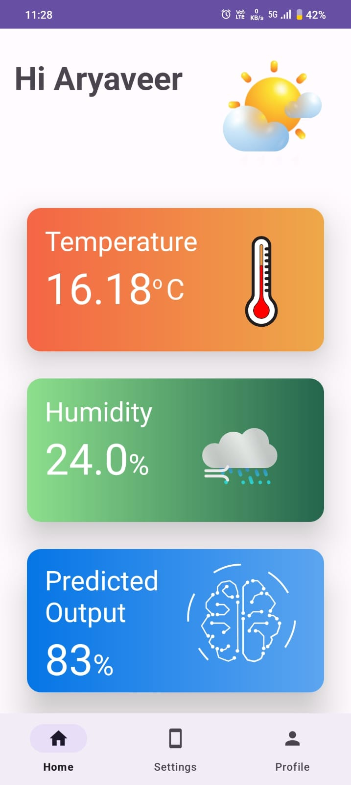
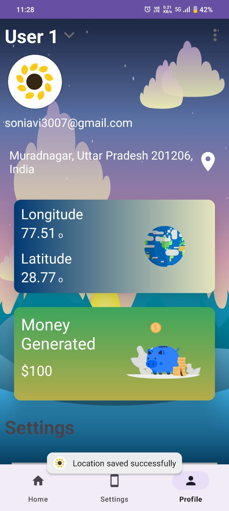
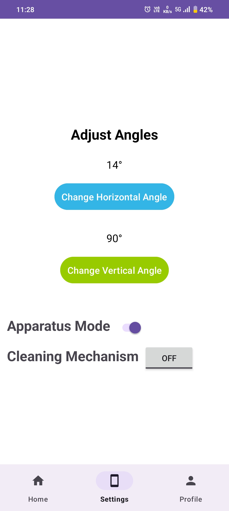
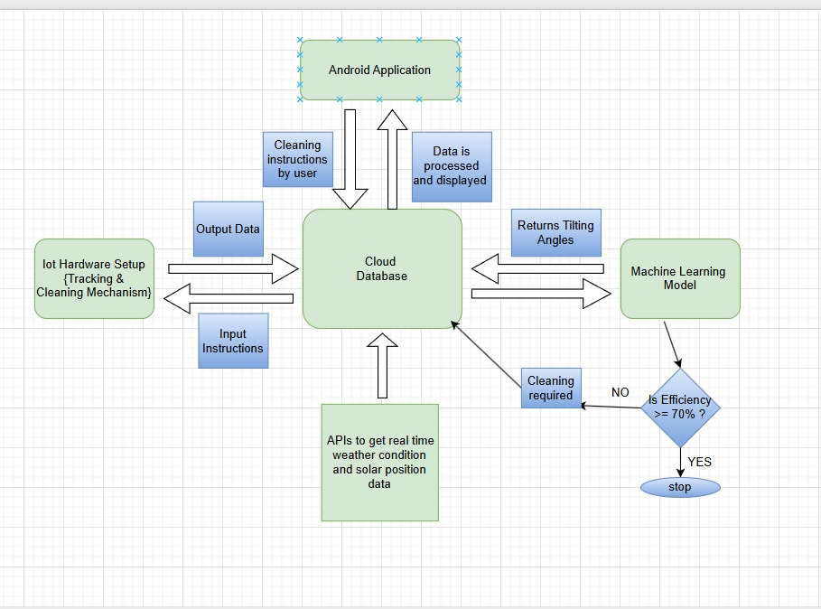
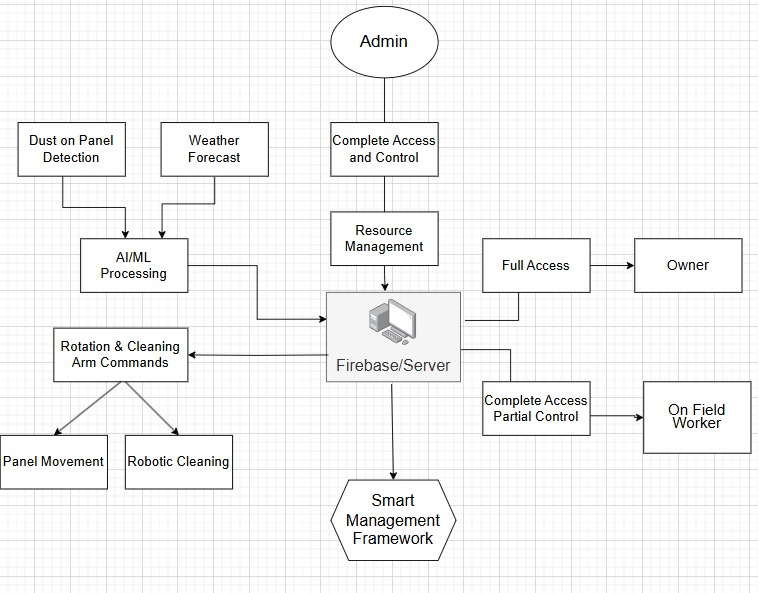

# 🌻 Suryamukhi

 Patent-backed Android application for an intelligent solar panel tracking and cleaning system.

## Overview

Suryamukhi is a smart solar energy project aimed at improving the efficiency of solar panels through automated tracking and cleaning. This repository focuses on the Android application, which acts as the control and monitoring interface for the entire system.

## My Role

As the Android Developer, I was responsible for designing and building the mobile application from the ground up.

### Responsibilities

* Developed the complete Android application using Kotlin
* Followed MVVM architecture for scalable development
* Integrated real-time communication with the IoT hardware
* Built dashboards for monitoring system status and sensor data
* Implemented control interfaces for tracking and cleaning operations
* Designed a responsive and intuitive Material UI
* Optimized application performance and reliability

## Features

* 📊 Live monitoring dashboard
* ⚡ Real-time device status
* 📱 Remote control interface
* 🔄 Data synchronization
* 🎨 Clean Material Design UI

## Tech Stack

* Kotlin
* Android SDK
* MVVM Architecture
* Firebase
* Material Design
* Git & GitHub

---

# 📱 Android Application

  
  
  

---

# 🛰️ System Architecture

  
  

---

# 🔧 IoT Prototype

  

---

# 🏆 Achievement

Suryamukhi was developed during Innogeeks club event and later was recognised in 2 different hackathons where our solution was recognized for its innovation and practical impact.
IEE SSH'24 and Navonmesh Idea Challenge'25

  
  

---

## Repository Focus

This repository showcases the Android application developed for the Suryamukhi project. While the overall solution combines IoT hardware and intelligent automation, the primary focus here is the design, architecture, and implementation of the Android application.
